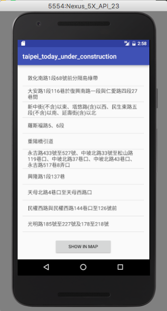

# 台北市政府 臺北市今日施工資訊

## Data
The data is from [Taipei Open data platform](http://data.taipei)

## Features
Fetch information from [Taipei Open data platform](http://data.taipei) immediately.
Parse the result to jsonobject.
Make a listview for user to know how many places are under construncion.
Put markers on map.

## Activities
- MainActivity
	list construction infomation
- MapsActivity
	make markers on google map by address

## screenshot
- listview

- listitem onclick

- mapview

## api key
before build and run 
### replace MAPKEY in
- app/src/debug/res/valuesgoogle_maps_api.xml
- app/src.main/AndroidManifest.xml
### replace GEOKEY in 
- app/src/main/java/necisam/kk_map/MapsActivity.java

## Future work
- Network Delay Handle(network delay,reconnect...)
- Error handle
- Data cache(limited geocoding api)
- UI design
- address preprocess(some address contains multiple place , which has no result after geoconding, for example 成功路一段32號、88號及松河街(向陽路口)共三處檢視井)
- 

## License
Apache License 2.0
